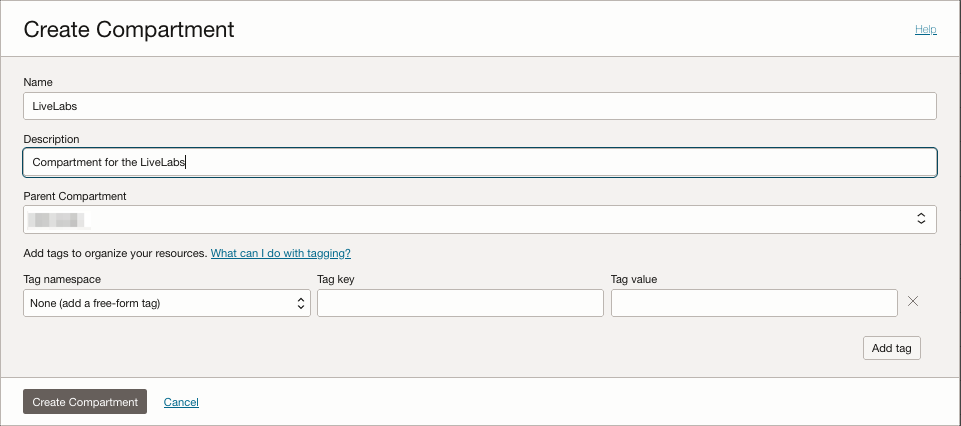

# Create OCI identity and Access Management Resources

## Introduction

In this lab, we will create the required Identity and Access Management (IAM) resources needed to support this workshop.

Estimated Time: 20 minutes

### Objectives

In this lab, you will:
* Create a compartment where the OCI components will reside
* Create a group
* Create policies

### Prerequisites

This lab assumes you have:
* A valid Oracle Cloud Infrastructure paid account.
* The necessary privileges to create the resources in this lab.

## Task 1: Create a compartment "LiveLabs"

1. Click the navigation menu, click the link Identity & Security, and then Compartments.

	

2. Click the Create Compartment button. Enter the required details, the Name *LiveLab* and Description *Compartment for the LiveLabs*, select a Parent Compartment. Click the Create Compartment button to create the desired compartment.

	

## Task 2: Create a group

1. Click the navigation menu, click the link Identity & Security, and then Domains.

	

	> **_NOTE:_** For old tenancy without *Domains*, you will find the menu *Group* under *Identity*

2. Make sure you are in the root compartment and click on the Default domain.

	

3. Click on Groups and Create Group

	

4. Enter the required details, the Name `DBMGMT_LiveLabs_Group` and Description *Database Management Group associated to the compartement LiveLabs* and select users to add to this group. Click on Create.

	

## Task 3: Create policies

Policy to allow the service Database Management (dpd) to read secret in the Vault service for the tenancy.

1. Under the Identity menu on the left, click the Policies link.

	

2. Click the Create Policy button. Enter the required details, the Name *DBMGMT_Service_Policy_Tenancy* and Description *Service policy required for Database Management service to read secrets in Vault for the tenancy*. Select the *root* compartment where this resource will be created in. Switch the Show manual editor toggle to enable.

	

	Enter the following rule and click *Create*.
	```
	<copy>Allow service dpd to read secret-family in tenancy</copy>
	```

3. Click the Create Policy button. Enter the required details, the Name *DBMGMT_User_Policy_LiveLabs* and Description *User policy for Database Management service for compartement LiveLabs*. Select the *root* compartment where this resource will be created in. Switch the Show manual editor toggle to enable.

	Enter the following rule and click Create.
	```
	<copy>Allow group 'DBMGMT_LiveLabs_Group' to manage dbmgmt-family in tenancy where any {target.compartment.name = 'LiveLabs'}
	Allow group 'DBMGMT_LiveLabs_Group' to manage metrics in tenancy where any {target.compartment.name = 'LiveLabs'}
	Allow group 'DBMGMT_LiveLabs_Group' to manage alarms in tenancy where any {target.compartment.name = 'LiveLabs'}
	Allow group 'DBMGMT_LiveLabs_Group' to manage objects in tenancy where any {target.compartment.name = 'LiveLabs'}
	Allow group 'DBMGMT_LiveLabs_Group' to manage buckets in tenancy where any {target.compartment.name = 'LiveLabs'}
	Allow group 'DBMGMT_LiveLabs_Group' to use database-family in tenancy where any {target.compartment.name = 'LiveLabs'}
	Allow group 'DBMGMT_LiveLabs_Group' to use external-database-family in tenancy where any {target.compartment.name = 'LiveLabs'}
	Allow group 'DBMGMT_LiveLabs_Group' to use autonomous-database-family in tenancy where any {target.compartment.name = 'LiveLabs'}
	Allow group 'DBMGMT_LiveLabs_Group' to manage virtual-network-family in tenancy where any {target.compartment.name = 'LiveLabs'}
	Allow group 'DBMGMT_LiveLabs_Group' to manage secret-family in tenancy where any {target.compartment.name = 'LiveLabs'}</copy>
	```

## Acknowledgements
* **Author** - <Name, Title, Group>
* **Contributors** -  <Name, Group> -- optional
* **Last Updated By/Date** - <Name, Month Year>
