# Provision the environment

## Introduction

In this lab, we will create the infrastructure that will be used to complete the following labs. The infrastructure will contain the network components (VCN, subnets, NSG, etc), one Database Cloud Service (DBCS) and one Autonomous Database (ADB). We must create a Vault entry to securely store the password. Database Management Private Endpoint will also need to be created to allow communication between Database Management service and the DBCS.

Estimated Time: 90 minutes

### Objectives

In this lab, you will:
* Create the network infrastructure
* Create one Enterprise Edition DBCS and a Vault entry
* Create the Database Management Private Endpoint and Network Security Group (NSG)
* Create one Enterprise Edition ADB


### Prerequisites

This lab assumes you have:
* A valid Oracle Cloud Infrastructure paid account.
* The necessary privileges to create the resources in this lab.

## Task 1: Create the network components

1. From OCI Console main page, click on *Set up a network with wizard*.

	

2. Click on *Start VCN Wizard*

	

3. Provide the VCN Name *VCN_LiveLabs* and the *LiveLabs* Compartment. You have to provide a VCN CIDR block of your choice.

	

4. Provide the CIDR block for the public and private subnets and click on *Next*.

	

5. Validate the *Review and create* page and click on *Create*.

	

6. The VCN is successfully created.

	

## Task 2: Create the DBCS and Vault entry

1. Click the navigation menu, click the link *Oracle Database*, and then *Oracle Base Database (VM, BM)*.

	

2. Select the *LiveLabs* compartment and click on *Create DB system*.

	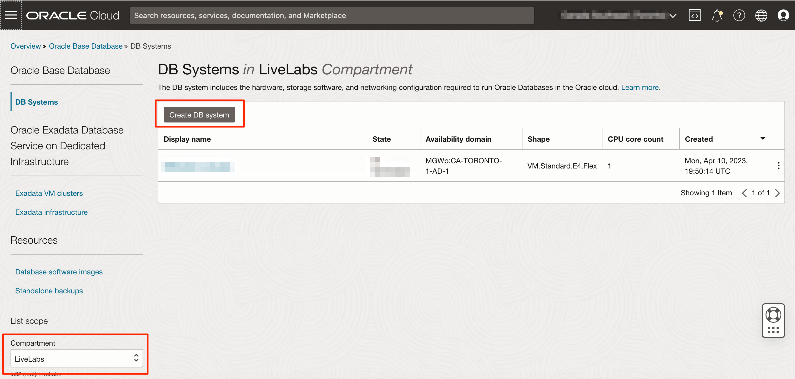

3. Provide the following information: Name of the DB System *DBSystem-LiveLabs*. Click on *Change shape* and change for *1 core*

	


4. Change the Oracle Database software edition to *Enterprise Edition*. Upload your SSH key.

	

5. Select *Bring Your Own Licence* type. To ease the access to the DBCS during the lab, provide the VCN and public subnet information and the hostname and click on *Next*.

	

6. Provide the Database name *CDB01*, the PDB name *PDB01*. and password with sys and TDE. You can also disable database backups. Click on *Create DB system*.

	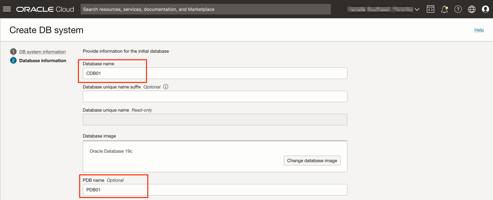

7. Using your prefered client tool, connect to the new CDB using *sys* user. Run the following SQL statements to configure the DBSNMP user account. This user will be used by Database Management.

	```
	<copy>GRANT CREATE PROCEDURE TO DBSNMP CONTAINER=ALL;</copy>
	<copy>GRANT SELECT ANY DICTIONARY, SELECT_CATALOG_ROLE TO DBSNMP CONTAINER=ALL;</copy>
	<copy>GRANT ALTER SYSTEM TO DBSNMP CONTAINER=ALL;</copy>
	<copy>GRANT ADVISOR TO DBSNMP CONTAINER=ALL;</copy>
	<copy>GRANT EXECUTE ON DBMS_WORKLOAD_REPOSITORY TO DBSNMP CONTAINER=ALL;</copy>
	<copy>GRANT CREATE SESSION TO DBSNMP CONTAINER=ALL;</copy>
	<copy>ALTER USER DBSNMP ACCOUNT UNLOCK;</copy>
	<copy>ALTER USER DBSNMP IDENTIFIED BY "<password>";</copy>
	```
	> **_NOTE:_** Change `<password>` by a password of your choice.

8. The service Vault is necessary to securely store the DBSNMP password. Click the navigation menu, click the link *Identity & Security* and click on *Vault*

	

9. Make sure you are in the *LiveLabs* compartment and click on *Create Vault*

	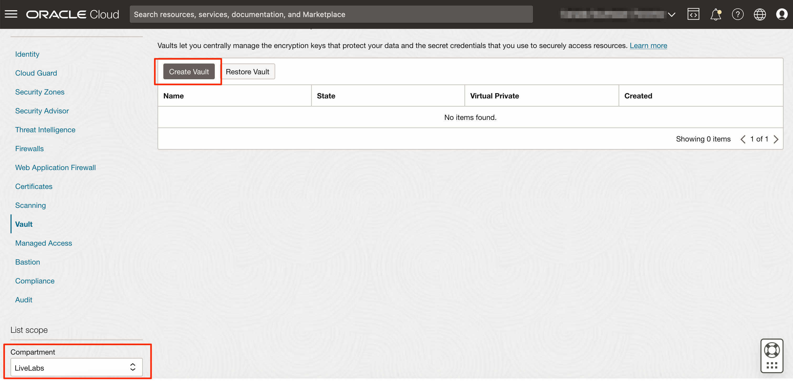

10. Provide the name *LiveLabs_Vault1* and click on *Create Vault*

	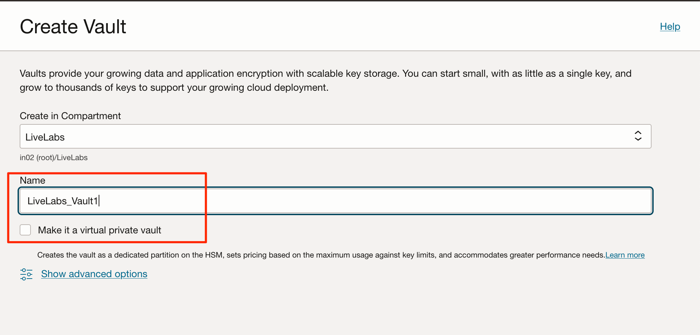

11. Select the newly created vault and click on *Master Encryption Keys* under *Resources*. Click on *Create Key*.

	

12. Make sure you are in the *LiveLabs* compartment, use Protection Mode *Software* and provide the name *DBSystem-LiveLabs_Key*. Click on *Create Key*.

	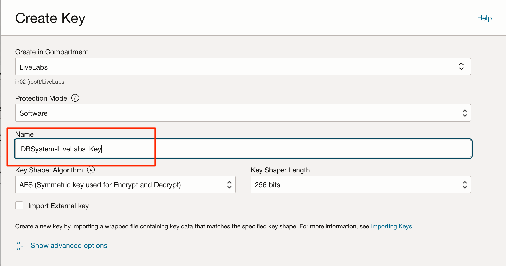

13. Select the newly created vault and click on *Secret* under *Resources*. Click on *Create Secret*.

	

14. Make sure you are in the *LiveLabs* compartment, provide the name *DBSystem-LiveLabs_DBSNMP*, the description *Password of the user DBSNMP*, select the Encrytion Key previously created, and provide the secret content, the DBSNMP password. Click on *Create Secret*.

	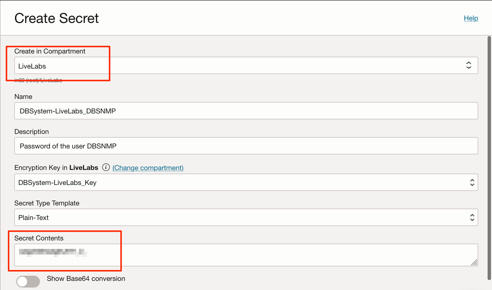

15. Using the same procedure, create a secret with the name *DBSystem-LiveLabs_SYS*, the description *Password of the user SYS*, select the Encrytion Key previously created, and provide the secret content, the SYS password. Click on *Create Secret*. This will be use in the lab #5.


	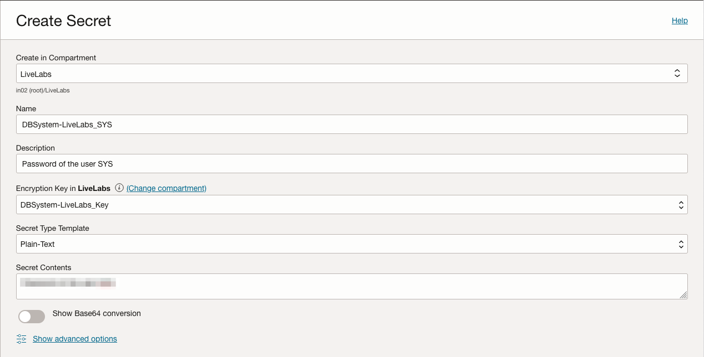

## Task 3: Create the Database Management Private Endpoint and Network Security Group (NSG)

The database management private endpoint should resides in the database subnet and allows communication between the database and Database Management service.

1. Click the navigation menu, click the *Observability & Management* menu item, and then *Administration* under *Database Management*.

	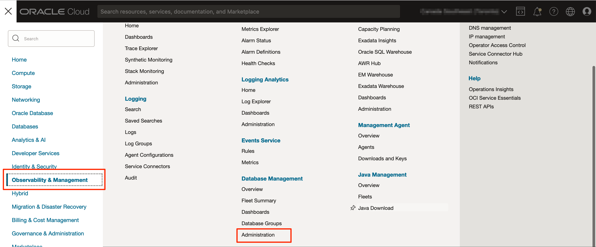

2. Select *Private Endpoint* under *Administration*. Make sure you are in the *LiveLabs* compartement and click on *Create private endpoint*.

	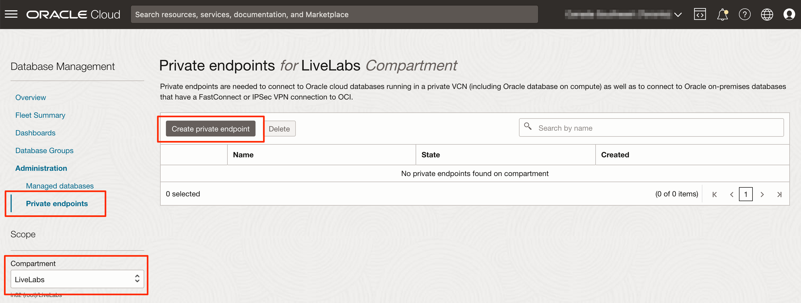

3. Provide the name `LiveLabs_DBMGMT_PrivateEndpoint`, the description *Database Management PrivateEndpoint for LiveLabs compartment*, make sure you are in the *LiveLabs* compartment and provide the VCN and public subnet information where the DBCS resides. Click on *Create private endpoint*.

	

	> **_NOTE:_** The information for the Network Security Group will be provided later in the lab. Leave the section empty.

4. Click on the newly created private endpoint and take note of the *Private IP*.

	

5. The NSG will allow communication between the database systems and the Database Management service through the private endpoint. Click the navigation menu, click the link *Virtual cloud networks*, select the VCN *VCN_LiveLabs*, click on *Network Security Groups (0)* and click on *Create Network Security Group*

	

6. Provide the name `NetworkSecurityGroup_LiveLabs_DatabaseManagement` and make sure you are in the compartment *LiveLabs*. Click on *Next*.

	

7. Provide the required 2 *Security Rules*. Click on *Create*.

	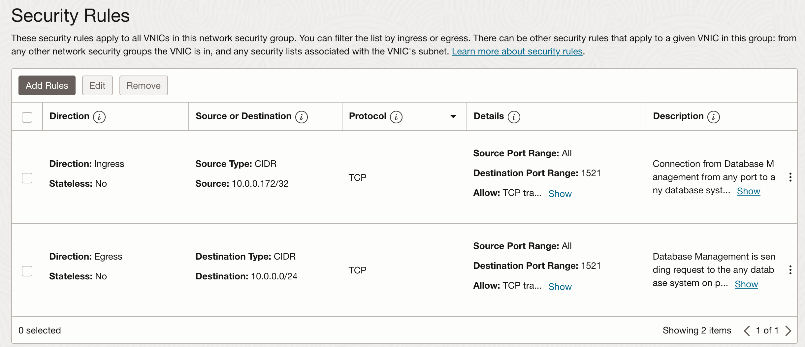

| Direction  | Source Type | Source CIDR | IP Protocol | Destination Port | Description |
| ------------- | ------------- | ------------- | ------------- | ------------- |
| Ingress  | CIDR  | IP address of the Database Management Private Endpoint (10.0.0.172/32) | TCP | 1521 | Connection from Database Management from any port to any database system on port 1521 in the database subnet |
| Egress  | CIDR  | Range IP address of the database subnet (10.0.0.0/24) | TCP | 1521 | Database Management is sending request to the any database system on port 1521 in the database subnet |

8. Assign the new NSG to the database system. From the DBCS homepage, click on *Edit* next to *Network security groups*.

	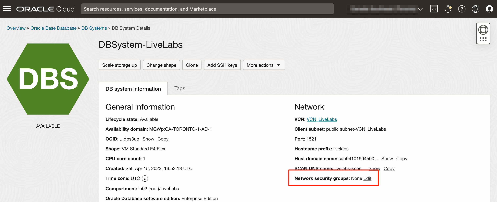

9. Select `NetworkSecurityGroup_LiveLabs_DatabaseManagement` and click on *Save changes*.

	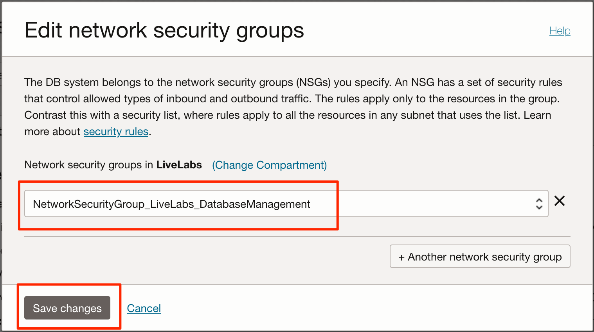

10. Assign the new NSG to the Database Management Private Endpoint. Select the newly created private endpoint and click on *Network Security Groups: 0*.

	

11. Select `NetworkSecurityGroup_LiveLabs_DatabaseManagement` and click on *Save changes*.

	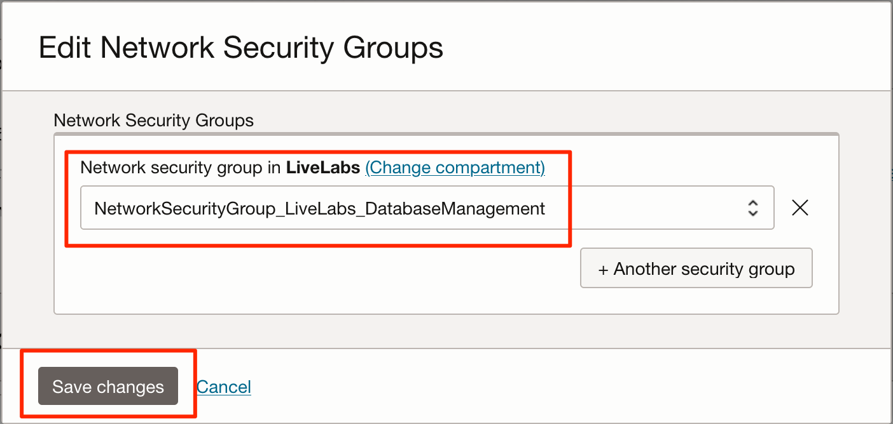


## Task 4: Create the ADB

1. Click the navigation menu, click the link *Oracle Database*, and then *Autonomous Transaction Processing*.

	

2. Select the *LiveLabs* compartment and click on *Create Autonomous Database*.

	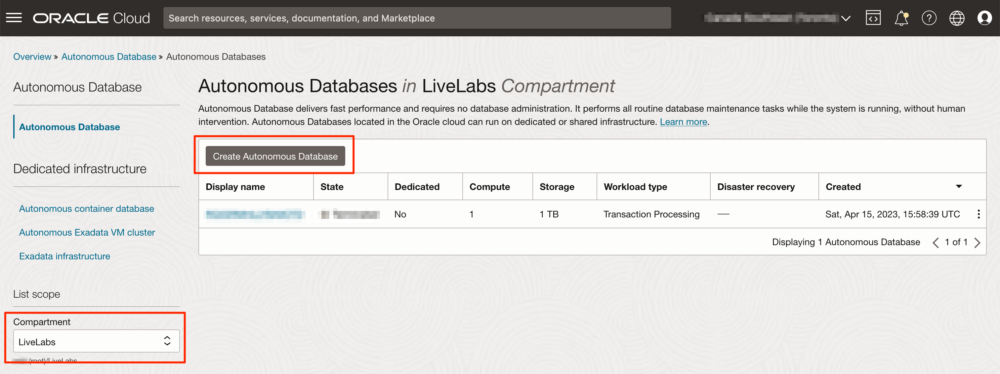

3. Provide the following information, *LiveLabs* Compartment, Display Name, Database Name. Select the desired workload type.

	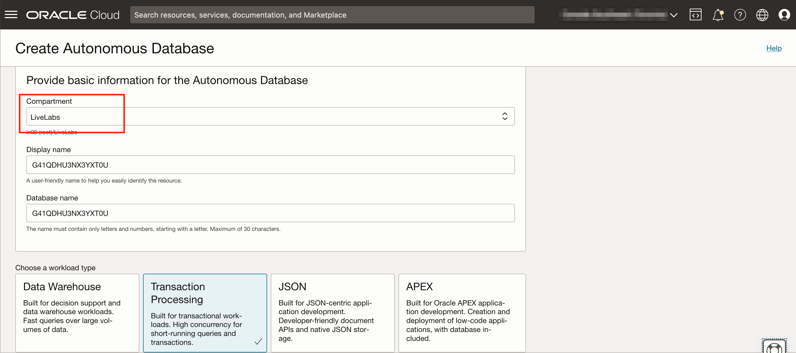

4. Select the Deployment type *Shared infrastructure*. Make sure not to use *Always Free* ADB.

	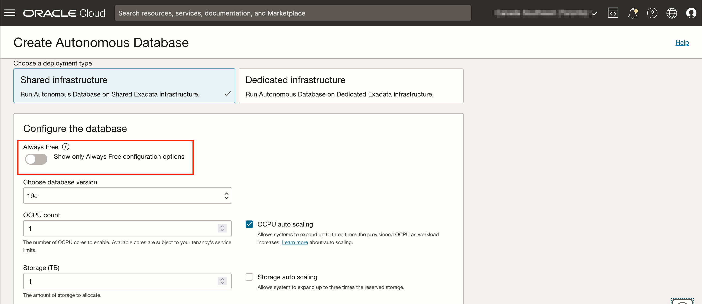

5. Continue by providing the *ADMIN* password. To ease access to the ADB during the lab, select *Secure access from everywhere*.

	

6. Complete by providing the license type *Bring your own license (BYOL)*, Database Edition *Enterprise Edition* and a contact email. Click on *Create Autonomous Database*.

	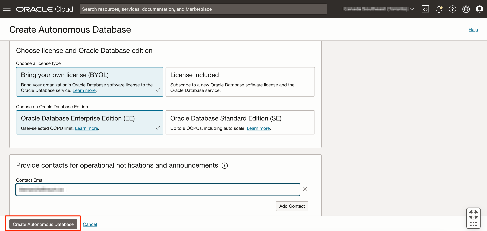

You may now proceed to the next lab.

## Acknowledgements
* **Author** - Luc Demanche, Cloud & DBA Practice Director, Insum Solutions Inc.
* **Last Updated By/Date** - Luc Demanche, April 2023
